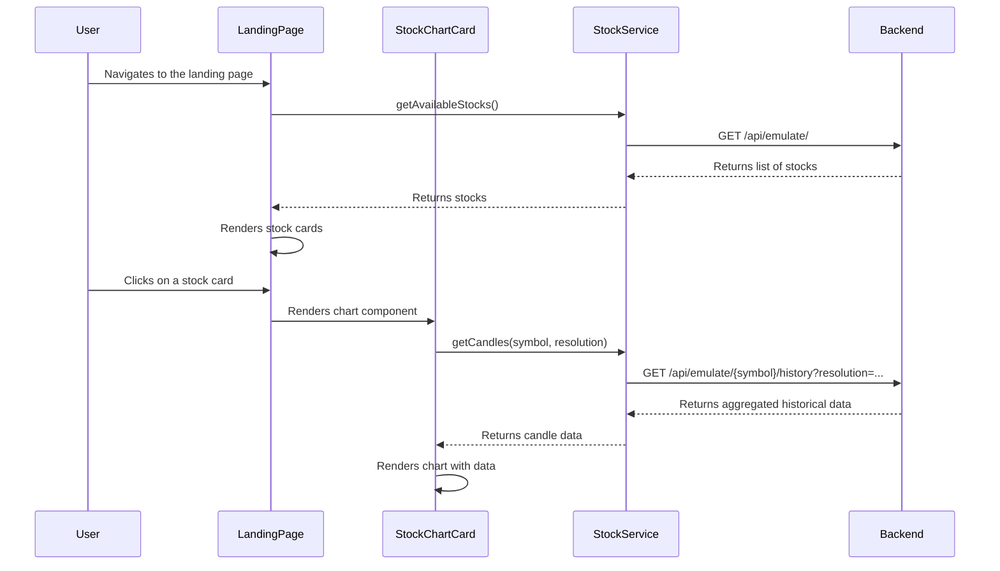

# Data Flow and Backend Interaction

This document outlines how the frontend application interacts with the backend, with a specific focus on the stock data emulation service.

## Service Layer: `stockService.ts`

All communication with the backend is managed through a dedicated service layer. The `stockService` is the primary interface for fetching all stock-related data, including prices, historical data, and search results. This approach decouples the UI components from the data fetching logic, making the application easier to maintain and test.

## Stock Emulation Backend

The frontend communicates with a backend service that emulates a live stock market. This backend is responsible for generating and providing realistic, but simulated, stock data. The key features of the emulation backend are:

-   **On-the-Fly Price Generation**: When a stock's price is requested for the first time, the backend generates an initial price and begins a background process to simulate price fluctuations over time.
-   **Persistent History**: The backend maintains a consistent history for each stock. When historical data is requested, it can backfill data points to ensure that charts for different timeframes (e.g., 1D, 1M, 1Y) are populated with a realistic number of candles.
-   **Resolution-Based Aggregation**: The backend can aggregate the fine-grained (one-minute) historical data into different resolutions (e.g., 30-minute, daily, weekly candles) based on the `resolution` parameter sent by the frontend.
-   **Stock Search**: The backend provides an endpoint to search for stocks by symbol or company name.

## Data Fetching Flow

The following diagram illustrates the typical data flow when a user views a stock chart on the landing page:

### Key Steps:

1.  **Initial Load**: The `landingView` fetches a list of available stocks from the backend to display as clickable cards.
2.  **User Interaction**: When the user clicks on a stock card or uses the search functionality, the `StockChartCard` component is rendered.
3.  **Fetching Chart Data**:
    -   The `StockChartCard` calls the `stockService.getCandles()` method, passing the stock symbol and the desired resolution (e.g., "1D", "1M").
    -   The `stockService` constructs a request to the backend's `/api/emulate/{symbol}/history` endpoint, including the `resolution` as a query parameter.
4.  **Backend Processing**: The backend receives the request, generates or retrieves the necessary historical data, aggregates it into the requested resolution, and returns it to the frontend.
5.  **Chart Rendering**: The `StockChartCard` receives the data and uses it to render or update the chart.
6.  **Live Price Updates**: A separate polling mechanism calls `stockService.getStockPrice()` every few seconds to get the latest price and update the UI accordingly. The service calculates the price difference (`diff`) on the client-side based on the previously fetched price. 